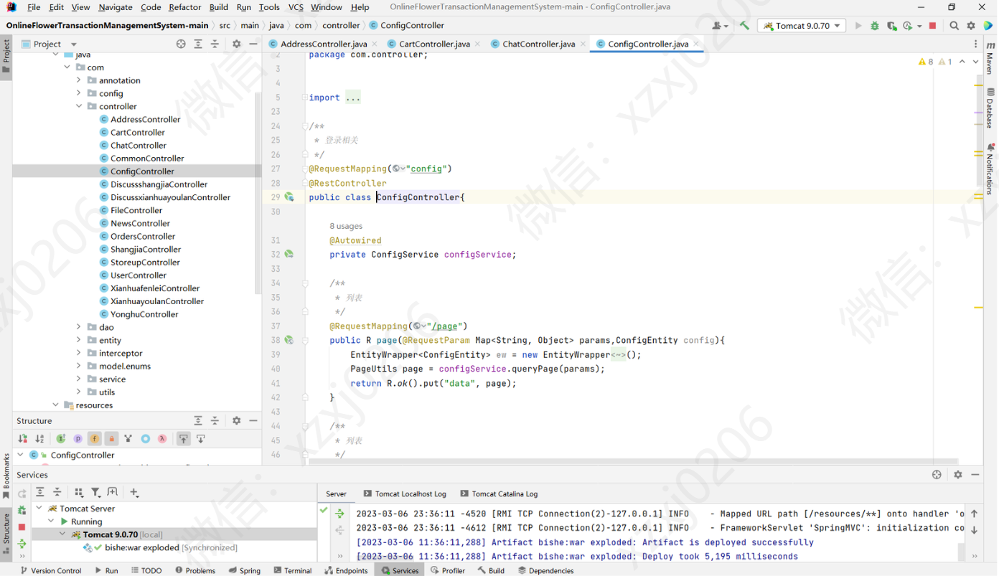
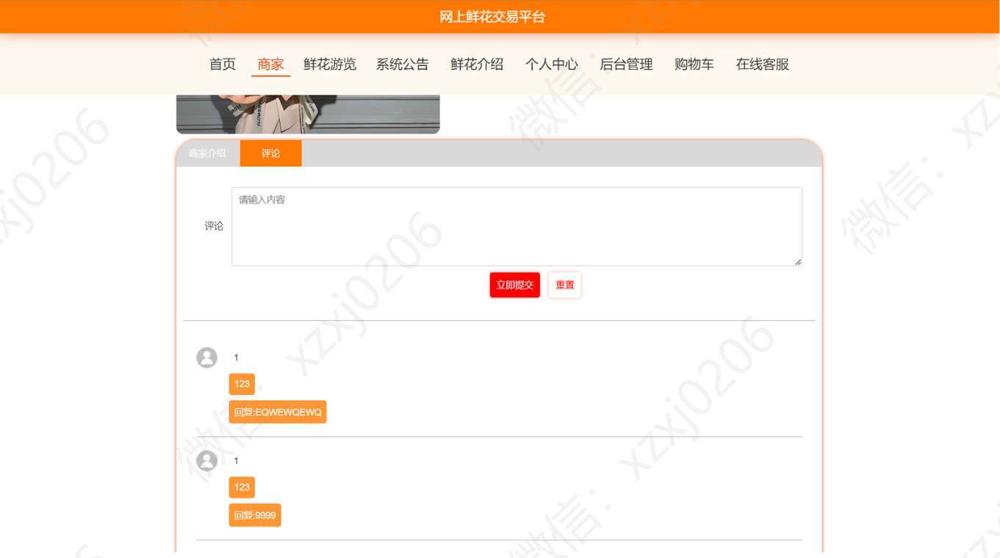
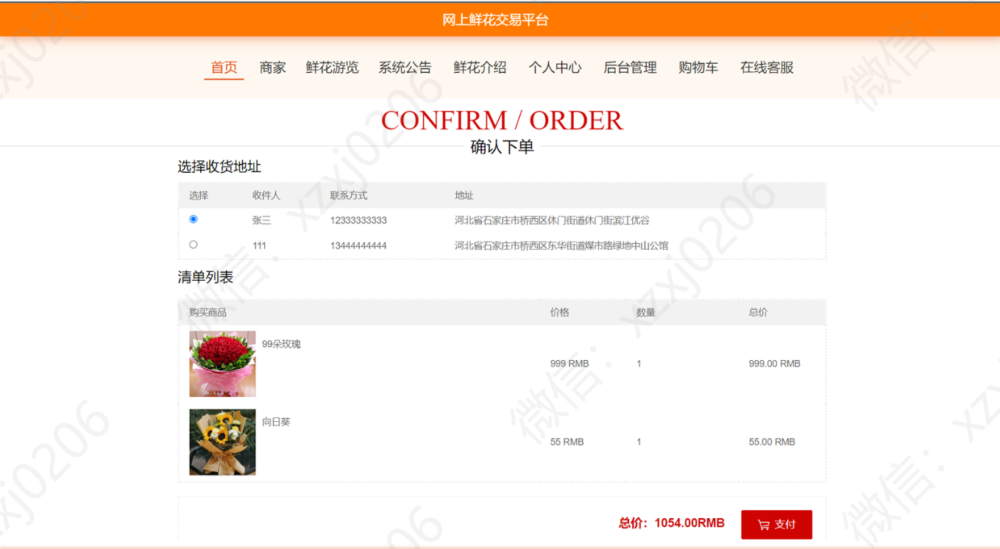

# 鲜花销售商城系统

### 有问题，或者需要协助调试运行项目的, 可以加QQ：2529519551，或者微信 ：xzxj0206 注明项目，“git+项目名称” ，如：“git学生宿舍管理系统”

### 更多项目： https://github.com/34426?tab=repositories

#### 介绍
基于SpringBoot和Mybatis的网上鲜花交易平台/商城系统

## 一、项目功能介绍
本系统分为用户、店家和管理员三种角色；

### 1、用户模块主要功能包括：

1、登录/注册，2、主页浏览，3、商家店铺浏览，4、评论浏览，5、发表评论，6、鲜花浏览，7、可以按花店、花名、用途、花语进行查询，8、查看系统公告，9、查看鲜花介绍，10、修改个人资料，11、查看订单，12、编辑收获地址，13、收藏鲜花和查看收藏，14、购买鲜花，15、查看购物车；

### 2、商家模块主要功能包括：

1、修改密码，2、修改商家信息，3、查看评论，4、新增鲜花商品

### 3、管理员模块主要功能包括：
1、修改密码和用户名，2、用户管理，3、商家管理（新增商家和删除商家），4、设置鲜花分类，5、设置鲜花浏览，6、公告管理，7、设置轮播图，8、所有订单管理

## 二、部分页面展示
### 1、用户模块部分功能页面展示

### 2、商家模块部分功能页面展示

### 3、管理员模块部分功能页面展示

